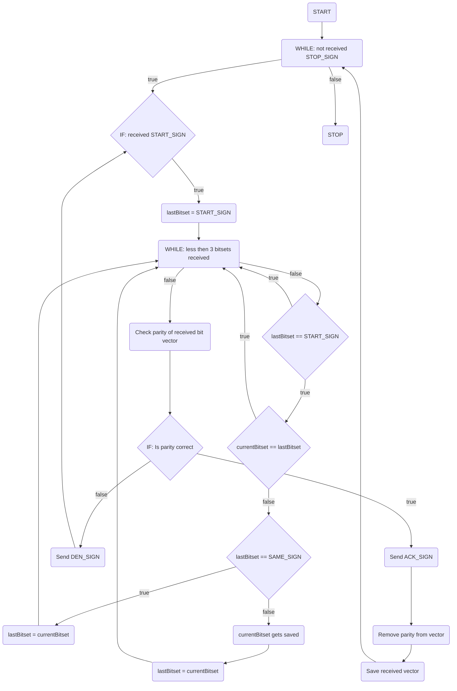
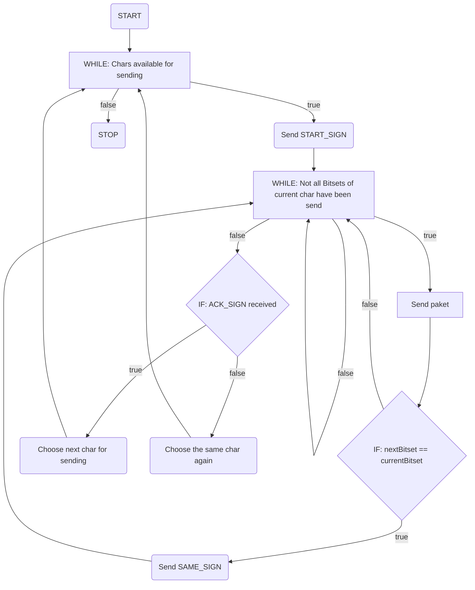

# 8-Bit Intercomputer Communication System


[](https://www.htwk-leipzig.de/)

A low-level communication system implementing 8-bit parallel data transfer between two ATmega microcontrollers. Developed as part of the Hardware Practical II module at Leipzig University of Applied Sciences.

## ✨ Key Features 

- **8-Bit Parallel Protocol** with hardware-level register control
- **Error Detection** through parity bit verification
- **Flow Control** using `ACK`/`DEN` handshaking
- **Data Framing** with `START`/`STOP` sequence markers
- **Collision Avoidance** through `SAME_SIGN`  repetition detection
- **Timeout Handling** with configurable retry intervals

## 🖥️ Hardware Requirements 

| Component          | Specification                          |
|--------------------|----------------------------------------|
| Microcontrollers   | 2× ATmega series chips                 |
| Connection         | 8-bit parallel bus + control lines     |
| Development Board  | B15F-compatible interface              |
| Power Supply       | Lab-grade 5V DC source                 |

## 📡 Communication Protocol 

### Flowchart

#### Sending-PC 



#### Receiving-PC



### Example Sequence

```plaintext
[Sender]                          [Receiver]
   |                                   |
   |───START_SIGN (0x08)──────────────>|
   |                                   |
   |───CHAR 1 - PACKET 1──────────────>| 
   |───CHAR 1 - PACKET 2──────────────>| 
   |───CHAR 1 - PACKET 3──────────────>| ✓ Parity correct
   |                                   |
   |<───────────────ACK (0x0B)─────────| ✓ 
   |                                   |
   |───CHAR 2 - PACKET 1──────────────>|
   |───CHAR 2 - PACKET 2──────────────>|
   |───CHAR 2 - PACKET 3--─-─-─-─-─-─->| ✗ Error in parity
   |                                   |
   |<───────────────DEN (0x09)─────────| ✗ 
   |                                   |
   |───CHAR 2 - PACKET 1 [RETRY]──────>| 
   |───CHAR 2 - PACKET 2 [RETRY]──────>|
   |───CHAR 2 - PACKET 3 [FIXED]──────>| ✓ Parity correct
   |                                   |
   |<───────────────ACK (0x0B)─────────| ✓
   |                                   |
   |───STOP_SIGN (0x0F)───────────────>|

```

### Control Codes

| Code | Hex | Purpose | 
| ------ | ------ | ------ | 
| REQ_SIG	| 0x0C | Transmission request |
| START_SIGN | 0x08 | Begin transmission | 
| SAME_SIG | 0x0A | Repeat previous character | 
| ACK_SIG	| 0x0B | Acknowledge - Parity is correct | 
| DEN_SIG | 0x09 | Denial - Parity is incorrect | 
| STOP_SIGN | 0x0F | End transmission | 

## 🔧 Technical Implementation 

### Data Packaging

- 3-Bit Chunking: 8-bit bytes split into three 3-bit packages
- Parity Generation: Even parity calculated across all bits, saved in the ninth bit
- Frame Assembly:

```cpp
vector<uint8_t> createBinaryVector(uint8_t num) {
    vector<uint8_t> binaryVector;
    for(int i=0; i<3; i++)
        binaryVector.push_back(7 & (num >> (i*3)));
    return binaryVector;
}
```

### Error Handling

- 40×500ms retry window for ACK
- Automatic DEN-triggered retransmission
- Parity verification through bit counting:

```cpp
bool checkParity(vector<uint8_t> binaryVector) {
    uint8_t parity = (binaryVector[2] >> 2);
    removeParity(binaryVector);
    return parity == (countOnes(binaryVector) % 2);
}
```

## 📜 License

This project is licensed under the MIT License - see the LICENSE file for details.

---

> Developed with ❤️ during my studies at HTWK Leipzig  
> 🚀 Feel free to contribute or fork this project!
